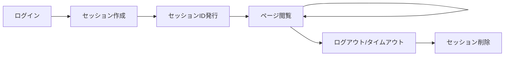

# Webアプリケーション認証講義
## 1時間で学ぶ認証の基礎とセキュリティ

### React + Hono デモアプリで実践的に理解

---

## 📋 今日の学習内容

1. **認証とは何か？** - 基本概念の理解
2. **セッションとは何か？** - HTTPの課題と解決策
3. **ステートフル vs ステートレス** - 設計思想の違い
4. **認証方式の種類** - 5つの主要な方式
5. **セキュリティ脆弱性** - よくある攻撃と対策
6. **実践デモ** - React + Hono での実装

---

## 🔐 認証とは何か？

### 認証 vs 認可

- **Authentication（認証）** 
  - **「あなたは誰ですか？」**
  - ユーザーの身元確認
  - 例：パスワード、指紋、顔認証

- **Authorization（認可）**
  - **「何をしてもよいですか？」**
  - 権限の確認
  - 例：管理者権限、読み取り専用

---

## 🤔 なぜ認証が必要？

### セキュリティの基本原則

```
🏠 家に例えると...

認証 = 玄関の鍵・指紋認証
↓
「家の住人であることを証明」

認可 = 各部屋への立ち入り権限  
↓
「どの部屋に入ってよいか決定」
```

---

## 📡 セッションとは何か？

### HTTPの課題
- **HTTPはステートレス** - 前回のやり取りを忘れる
- 毎回「あなたは誰ですか？」と聞いてしまう

### セッションによる解決
```
❌ 問題のある状況：
ブラウザ「ログインしました！」  
サーバー「わかりました」

ブラウザ「マイページを表示して」
サーバー「あなた誰ですか？」← 忘れている！
```

---

## 🔄 セッションのライフサイクル



### セッションデータの中身
- **SessionID**: ABC123456789
- **UserID**: user001  
- **Role**: admin
- **LoginTime**: 2024-01-01 10:00
- **LastAccess**: 2024-01-01 10:30

---

## 🏪 セッションの日常例え

### お店での買い物

```
👤 あなた（ブラウザ）     👨‍💼 店員（サーバー）

「入店します」           「いらっしゃいませ」
                      → セッション開始

「Tシャツ見たいです」     「かしこまりました」
                      → 状態を記憶

「さっきのTシャツください」 「はい、覚えております」
                      → セッション継続

「ありがとうございました」  「またお越しください」
                      → セッション終了
```

---

## 📊 ステートフル vs ステートレス

| 項目 | ステートフル | ステートレス |
|------|-------------|-------------|
| **状態管理** | サーバー側で管理 | クライアント側で管理 |
| **メモリ使用** | ユーザー数に比例 | 一定 |
| **スケーラビリティ** | 困難 | 容易 |
| **障害耐性** | 低い | 高い |
| **実装例** | セッション認証 | JWT認証 |

---

## 🔗 セッションとステートの関係（まとめ）

### 概念の整理

- **ステート（状態）** = 「誰がログインしているか」などの **情報そのもの**
- **セッション** = その状態情報を **管理する仕組み・期間**

### 実装での違い

**ステートフル認証**
- セッション = サーバー側で管理
- セッションID → サーバーに送信
- ステート（状態）→ サーバーで保存・管理

**ステートレス認証**  
- 「セッション」概念は使わない
- JWT等のトークン → クライアントに送信
- ステート（状態）→ トークン内に含める

---

## 🛠️ 認証方式の種類

### 1. 基本認証（Basic Authentication）
```http
Authorization: Basic base64(username:password)
```
- ✅ シンプル
- ❌ パスワードがBase64のみ（暗号化なし）

### 2. セッション認証
```
1. ログイン → サーバーがセッションID生成
2. クッキーにセッションID保存
3. 以降のリクエストでセッションID送信
```
- ✅ サーバー側で完全制御
- ❌ スケーリング困難

---

## 🔑 認証方式の種類（続き）

### 3. JWT（JSON Web Token）
```
Header.Payload.Signature
```
- ✅ ステートレス、スケーラブル
- ❌ トークンサイズが大きい、リボーク困難

### 4. OAuth 2.0
```
1. 認可サーバーにリダイレクト
2. ユーザー認証・同意
3. 認可コード取得
4. アクセストークン交換
```
- ✅ 第三者認証、標準プロトコル
- ❌ 実装が複雑

---

## ☁️ AWS Cognito認証

### マネージド認証サービス
- **User Pool**: ユーザー管理とJWT発行
- **Identity Pool**: AWS リソースへのアクセス
- **MFA内蔵**: SMS、TOTP、ハードウェアキー
- **スケーラブル**: サーバーレス

```
1. User Pool での認証
2. JWT トークン発行  
3. トークンでAPIアクセス
4. 必要に応じてMFA
```

---

## ⚠️ セキュリティ脆弱性

### 主要な攻撃手法

1. **クレデンシャルスタッフィング**
   - 他サイトの漏洩認証情報を使い回し

2. **セッションハイジャック**
   - セッションIDの盗取・悪用

3. **JWT攻撃**
   - アルゴリズム混同、弱い鍵の利用

4. **パスワードスプレー**
   - 複数アカウントに対する弱パスワード試行

---

## 🛡️ セキュリティ脆弱性（続き）

5. **ソーシャルエンジニアリング**
   - 人間の心理を突いた情報取得

6. **中間者攻撃（MITM）**
   - 通信傍受による認証情報窃取

### 📋 対策のポイント
- **HTTPS通信必須**
- **強力なパスワードポリシー**
- **レート制限・アカウントロック**
- **多要素認証（MFA）**
- **定期的なセキュリティ監査**

---

## 🔒 ベストプラクティス

### パスワード管理
- **ハッシュ化**: bcrypt、scrypt、Argon2
- **ソルト**: レインボーテーブル攻撃対策
- **最小長**: 8文字以上

### セッション管理
- **HTTPS必須**: Secure Cookie属性
- **HttpOnly**: XSS攻撃対策
- **SameSite**: CSRF攻撃対策
- **適切なタイムアウト**: セキュリティとUXのバランス

---

## 🚀 実践デモアプリ

### 技術スタック
- **フロントエンド**: React + TypeScript
- **バックエンド**: Hono（高速Webフレームワーク）
- **認証方式**: 5種類すべてを実装

### デモ内容
1. **基本認証** - HTTP Basic Authentication
2. **セッション認証** - Cookie + サーバーセッション
3. **JWT認証** - JSON Web Token
4. **AWS Cognito** - マネージド認証（モック）
5. **攻撃デモ** - 実際の脆弱性と対策

---

## 📱 デモアプリの特徴

### 学習に最適化された設計
- **タブ切り替え**: 各認証方式を個別体験
- **リアルタイム表示**: トークンやセッション情報の可視化
- **攻撃シミュレーション**: 安全な環境での脆弱性体験
- **視覚的図解**: SVGによる攻撃フローの図解

### セキュリティ教育
- **実際の攻撃ログ**: 攻撃の進行をリアルタイム表示
- **対策方法**: 各攻撃に対する具体的な防御策
- **ベストプラクティス**: 実装時の注意点

---

## 🎯 実装のポイント

### フロントエンド（React）
```typescript
// JWT認証の例
const login = async (credentials: LoginData) => {
  const response = await fetch('/api/jwt/login', {
    method: 'POST',
    headers: { 'Content-Type': 'application/json' },
    body: JSON.stringify(credentials)
  });
  
  const { token } = await response.json();
  localStorage.setItem('jwt', token);
};
```

### バックエンド（Hono）
```typescript
// JWT生成の例
app.post('/jwt/login', async (c) => {
  const token = jwt.sign(
    { userId: user.id, username: user.username },
    JWT_SECRET,
    { expiresIn: '1h' }
  );
  return c.json({ token });
});
```

---

## 📈 どちらを選ぶべきか？

### ステートフルが適している場面
- **従来のWebアプリケーション**
- **厳密なセッション管理が必要**
- **リアルタイムな状態変更が重要**
- **単一サーバーでの小規模運用**

### ステートレスが適している場面  
- **API中心のアプリケーション**
- **マイクロサービス**
- **モバイルアプリ**
- **大規模分散システム**

---

## 🔄 スケーラビリティの違い

### ステートフル認証の課題
```
ユーザー数 ↑ → メモリ使用量 ↑ → サーバー負荷 ↑
```

### ステートレス認証の利点
```
ユーザー数 ↑ → メモリ使用量 → （一定）
```

### 実際の運用での選択
- **小～中規模**: ステートフル（セッション認証）
- **大規模・分散**: ステートレス（JWT認証）
- **企業システム**: OAuth 2.0 + SSO
- **クラウドネイティブ**: AWS Cognito

---

## 🚨 攻撃デモで学ぶこと

### 6種類の攻撃シナリオ
1. **クレデンシャルスタッフィング**
   - よくあるパスワードでの総当たり
2. **セッションハイジャック**
   - セッションIDの盗取と悪用
3. **JWT署名偽造**
   - 弱い鍵やアルゴリズムの悪用
4. **パスワードスプレー**
   - 複数アカウントへの弱パスワード攻撃
5. **ソーシャルエンジニアリング**
   - フィッシングやなりすまし
6. **中間者攻撃**
   - 通信傍受による情報窃取

---

## 🛠️ 対策の実装例

### レート制限
```javascript
const rateLimit = {
  windowMs: 15 * 60 * 1000, // 15分
  max: 5, // 最大5回まで
  message: 'Too many login attempts'
};
```

### パスワード強度チェック
```javascript
const passwordPolicy = {
  minLength: 8,
  requireUppercase: true,
  requireLowercase: true,
  requireNumbers: true,
  requireSymbols: true
};
```

---

## 📊 セキュリティ監査のポイント

### 定期的にチェックすべき項目
- **パスワードポリシーの遵守**
- **不審なログイン試行の検知**
- **セッションタイムアウトの適切な設定**
- **HTTPS通信の徹底**
- **第三者ライブラリの脆弱性チェック**

### 監査ツール
- **OWASP ZAP**: 脆弱性スキャナー
- **Burp Suite**: ペネトレーションテスト
- **Snyk**: 依存関係の脆弱性チェック

---

## 🎓 今日の学習成果

### 理解できたこと
✅ **認証とセッションの基本概念**  
✅ **ステートフル vs ステートレスの違い**  
✅ **5つの主要な認証方式**  
✅ **セキュリティ脆弱性と対策**  
✅ **実際の実装方法**  

### 次のステップ
- **実際のプロジェクトで実装**
- **セキュリティテストの実施**
- **最新の脅威情報の収集**
- **継続的なセキュリティ改善**

---

## 🔗 参考資料・リンク

### 公式ドキュメント
- [OWASP Authentication Cheat Sheet](https://cheatsheetseries.owasp.org/cheatsheets/Authentication_Cheat_Sheet.html)
- [JWT.io](https://jwt.io/)
- [OAuth 2.0 RFC](https://tools.ietf.org/html/rfc6749)
- [WebAuthn Guide](https://webauthn.guide/)

### 実践リソース
- **デモアプリケーション**: React + Hono 実装
- **攻撃シミュレーション**: 安全な環境での体験
- **コードサンプル**: GitHub リポジトリ

---

## 💡 質疑応答

### よくある質問

**Q: セッション認証とJWT認証、どちらを選ぶべき？**
A: アプリケーションの規模と要件次第。小規模ならセッション、大規模・分散ならJWT。

**Q: AWS Cognitoの導入タイミングは？**
A: 認証機能の開発・運用コストを削減したい場合。特にスタートアップに有効。

**Q: 最も重要なセキュリティ対策は？**
A: HTTPS通信とMFA（多要素認証）。基本中の基本。

---

## 🙏 ありがとうございました

### 今日学んだことを実践に活かしましょう！

**連絡先・フィードバック**
- GitHub: [認証デモアプリリポジトリ]
- 質問・相談: いつでもお気軽に

**継続学習のお勧め**
- セキュリティ関連のニュースを定期チェック
- OWASP Top 10 の最新版を確認
- 実際のコードレビューでセキュリティ観点を意識

### セキュアな認証システムの実装を！